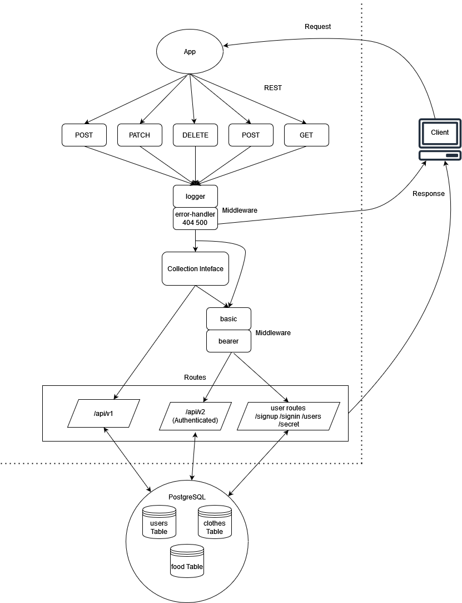

# Auth API

## Installation

  clone repo, and then in a terminal run the 'npm i' command while in the root directory to install dependencies.
  
  To run the application, enter the 'npm run start' command in a terminal while in the root directory.

## Summary of Problem Domain

  Create an auth api. Application requirements are as follows:
  
  Phase 1 requirements:

    Users will be able to create an account that will persist for future app visits

    Registered users will be able to login to their account so that they may access protected information

    App will have Proper CI/CD configuration

  Phase 2 requirements:

    A user will be able to obtain a token after they sign in, so that they can re-authenticated when certain actions are taken

    App shall have a route that only user with a valid token can use

    The JWT used in the application will be secured by 1+ methods

  Phase 3 requirements:

    Implement a Role Based Access Control system on the API using an Access Control List. 

## Links to application deployment

  App deployed on Heroku [here](https://auth-api-class08.herokuapp.com/)

  Pull req from dev found [here](https://github.com/Beers15/auth-api/pull/1)

## Uml Diagram

## Routes

* REST Method GET

  * Path: /secret
    * takes a request with an "Authorization" header with the value Bearer TOKEN that contains a properly encoded JWT
    * returns a secret message if the user is properly validated

  * Path: /users
    * returns list of users
    * requires delete capability

  * Path: /api/v1/get
    * returns all resources from the supplied model
  
  * Path: /api/v1/get/:id
    * returns a specific resources from the supplied model

  * Path: /api/v2/get
    * same as v1 but requires authentication

  * Path: /api/v2/get/:id
    * same as v1 but requires authentication

* REST Method POST
  * Path: /signin
    * T\takes a request with an "Authorization" header with the value Basic TOKEN that contains a properly encoded username and password combination
    * returns the user's data and a JWT token as output after account creation, or a proper error response if the request wasn't successful

  * Path: /signup
    * takes a JSON obj or form data as input with user and password information
    * returns the user's data and a JWT token as output after a successful login attempt, or a proper error response if the request wasn't successful

  * Path: /api/v1/:model
    * creates a resource of the supplied model
    * returns the created resource

  * Path: /api/v2/:model
    * same as v1 but requires authentication
    * requires create capability

* REST Method PUT
  * Path: /api/v1/:model/:id
    * updates a specified resource from the supplied model
    * returns the updated resource

  * Path: /api/v2/:model/:id
    * same as v1 but requires authentication
    * requires update capability

* REST Method DELETE
  * Path: /api/v1/:model/:id
    * deletes a specified resource from the supplied model
    * returns the deleted resource

  * Path: /api/v2/:model/:id
    * same as v1 but requires authentication
    * requires delete capability
